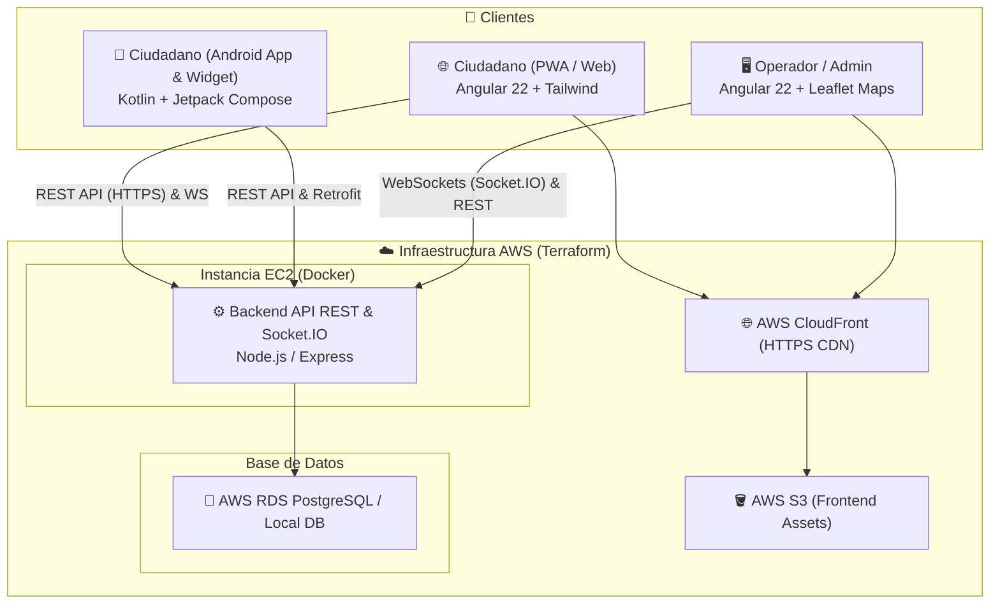

# 🚨 Seguridad Chaclacayo - Sistema de Gestión de Alertas en Tiempo Real

[](.github/workflows/deploy.yml)
[](frontend/)
[](backend/)
[](citizen-android/)
[](docker-compose.yml)
[](terraform/)

Solución integral y multiplataforma de seguridad ciudadana para la gestión, emisión y monitoreo de alertas de emergencia e incidencias en tiempo real con geolocalización precisa (GPS), soporte multimedia y despacho inmediato a operadores.

---

## 📌 Tabla de Contenidos

- [Visión General](#-visión-general)
- [Arquitectura del Sistema](#-arquitectura-del-sistema)
- [Componentes y Ecosistema](#-componentes-y-ecosistema)
  - [1. Backend API & WebSockets](#1-backend-api--websockets)
  - [2. Frontend Web & PWA (Angular)](#2-frontend-web--pwa-angular)
  - [3. Aplicación Móvil Nativa (Android)](#3-aplicación-móvil-nativa-android)
  - [4. Infraestructura en la Nube (AWS + Terraform)](#4-infraestructura-en-la-nube-aws--terraform)
- [Estructura del Proyecto](#-estructura-del-proyecto)
- [Guía de Inicio Rápido (Entorno Local)](#-guía-de-inicio-rápido-entorno-local)
  - [Requisitos Previos](#requisitos-previos)
  - [1. Base de Datos (Docker)](#1-base-de-datos-docker)
  - [2. Backend](#2-backend)
  - [3. Frontend Web](#3-frontend-web)
  - [4. Aplicación Android](#4-aplicación-android)
- [Variables de Entorno](#-variables-de-entorno)
- [Despliegue e Infraestructura](#-despliegue-e-infraestructura)
- [CI/CD Automation](#-cicd-automation)
- [Endpoints Principales de la API](#-endpoints-principales-de-la-api)
- [Autor](#-autor)

---

## 📖 Visión General

El sistema **Seguridad Chaclacayo** conecta a los ciudadanos directamente con el centro de control y monitoreo de seguridad ciudadana (Serenazgo / Operadores) mediante:

- **Botón de Pánico Instantáneo:** Envío inmediato de la ubicación GPS exacta del ciudadano en situación de peligro con solo un toque (desde Web/PWA, App Nativa o Widget de escritorio).
- **Reporte Detallado de Incidencias:** Registro de incidentes (asaltos, accidentes, disturbios) con descripción, fecha/hora exacta del suceso y evidencia fotográfica (cámara o galería).
- **Monitoreo en Tiempo Real (Admin Dashboard):** Recepción instantánea mediante **WebSockets (Socket.IO)** sin necesidad de recargar la página.
- **Geovisualización Interactiva:** Mapas interactivos con **Leaflet & OpenStreetMap** para ubicar las emergencias al instante con sus respectivas coordenadas.

---

## 🏗 Arquitectura del Sistema



---

## 🧩 Componentes y Ecosistema

### 1. Backend API & WebSockets
- **Tecnologías:** Node.js 22 LTS, Express 5, Socket.IO, Sequelize ORM, PostgreSQL.
- **Seguridad:** JWT (JSON Web Tokens), Bcrypt, Helmet, Express Rate Limit, CORS configurado.
- **Características:**
  - Emisión de eventos `nueva_alerta` en tiempo real hacia salas de operadores.
  - Subida y gestión de evidencia multimedia (Multer / AWS S3).
  - Gestión de usuarios y operadores con roles diferenciados (`ciudadano`, `operador`, `admin`).
  - Script de seed para poblar datos iniciales y usuarios de prueba.

### 2. Frontend Web & PWA (Angular)
- **Tecnologías:** Angular 22, TypeScript, Tailwind CSS, Leaflet, Socket.IO Client, `@angular/pwa`.
- **Características:**
  - **Módulo Ciudadano (PWA):** Botón de pánico interactivo, geolocalización HTML5, formulario de reporte con soporte de cámara/galería e instalación offline.
  - **Módulo Operador / Administrador:** Tabla reactiva de alertas, filtros, modal con mapa interactivo Leaflet (OpenStreetMap gratuito), vista de detalles de evidencia y gestión de operadores/ciudadanos.

### 3. Aplicación Móvil Nativa (Android)
- **Tecnologías:** Kotlin, Jetpack Compose, Material 3, Play Services Location, Retrofit2, OkHttp3, Coil, Socket.IO Client.
- **Características:**
  - Botón de pánico con animaciones táctiles y retroalimentación háptica/visual.
  - **App Widget de Pantalla de Inicio:** Envío de alerta de emergencia rápida directamente desde el launcher de Android sin abrir la app.
  - Captura y compresión de fotos para reportes de incidencias.

### 4. Infraestructura en la Nube (AWS + Terraform)
- **Tecnologías:** Terraform (IaC), AWS (VPC, Subnets, EC2 `t3.micro`, RDS PostgreSQL `db.t3.micro`, S3, CloudFront con OAC).
- **Capa:** Diseñado para operar 100% dentro del **AWS Free Tier**.

---

## 📁 Estructura del Proyecto

```plaintext
seguridad-chaclacayo/
├── .github/
│   └── workflows/
│       └── deploy.yml            # Pipeline CI/CD (Frontend, Backend, APK Android)
├── backend/                      # API REST & Servidor WebSockets (Node.js/Express)
│   ├── src/
│   │   ├── config/               # Conexión DB y configuración de Sequelize/S3
│   │   ├── middleware/           # Autenticación JWT y Rate Limiting
│   │   ├── routes/               # Rutas (auth, alertas, operadores, usuarios)
│   │   ├── index.js              # Punto de entrada y servidor Socket.IO
│   │   └── seed.js               # Semilla de datos iniciales
│   ├── Dockerfile                # Imagen Docker de producción para Backend
│   └── package.json
├── citizen-android/              # App móvil nativa (Kotlin & Jetpack Compose)
│   ├── app/                      # Código fuente Android, UI Compose, Widgets
│   ├── build.gradle.kts
│   └── gradlew
├── frontend/                     # Aplicación Web & PWA (Angular 21 + Tailwind)
│   ├── src/
│   │   └── app/
│   │       ├── admin/            # Dashboard del operador, mapa Leaflet y gestión
│   │       ├── auth/             # Login y Registro
│   │       ├── citizen/          # Botón de pánico y formulario de incidencias
│   │       └── core/             # Servicios (Auth, Socket, Alertas, Guards)
│   ├── angular.json
│   └── package.json
├── terraform/                    # Infraestructura como Código (AWS Free Tier)
│   ├── ec2.tf                    # Instancia EC2 para Backend
│   ├── rds.tf                    # Base de Datos PostgreSQL gestionada
│   ├── s3_cloudfront.tf          # Hosting estático + CDN HTTPS para Frontend
│   └── variables.tf
├── docker-compose.yml            # PostgreSQL para desarrollo local
├── prd.md                        # Documento de Requisitos del Producto
└── README.md                     # Documentación principal del repositorio
```

---

## 🚀 Guía de Inicio Rápido (Entorno Local)

### Requisitos Previos

- [Node.js](https://nodejs.org/) (v18 o v20 LTS recomendado) y npm.
- [Docker & Docker Compose](https://www.docker.com/) (para la base de datos local).
- [Angular CLI](https://angular.dev/tools/cli) (`npm install -g @angular/cli`).
- [Android Studio](https://developer.android.com/studio) & JDK 17+ (opcional, para compilar la app móvil).

---

### 1. Base de Datos (Docker)

Inicia una instancia local de PostgreSQL en el puerto `5432`:

```bash
docker-compose up -d
```

### 2. Backend

1. Entra a la carpeta del backend e instala dependencias:
   ```bash
   cd backend
   npm install
   ```

2. Crea tu archivo `.env` basado en la configuración local:
   ```env
   PORT=3000
   DB_HOST=localhost
   DB_PORT=5432
   DB_NAME=seguridad_chaclacayo
   DB_USER=postgres
   DB_PASSWORD=security_password_2026
   JWT_SECRET=tu_clave_secreta_jwt_desarrollo
   NODE_ENV=development
   CORS_ORIGIN=http://localhost:4200
   ```

3. (Opcional) Ejecuta el seed para crear usuarios de prueba:
   ```bash
   npm run seed
   ```

4. Inicia el servidor en modo desarrollo:
   ```bash
   npm run dev
   ```
   > El servidor estará escuchando en `http://localhost:3000`.

### 3. Frontend Web

1. Entra a la carpeta del frontend e instala dependencias:
   ```bash
   cd ../frontend
   npm install
   ```

2. Inicia el servidor de desarrollo de Angular:
   ```bash
   npm start
   # o bien: ng serve
   ```
   > Abre tu navegador en `http://localhost:4200`.

### 4. Aplicación Android

1. Abre la carpeta `citizen-android` en **Android Studio**.
2. Sincroniza el proyecto con Gradle.
3. Para probar con el backend local desde el emulador Android, la URL base predeterminada suele ser `http://10.0.2.2:3000` o tu IP local de red.
4. Compila y ejecuta en tu dispositivo o emulador:
   ```bash
   cd citizen-android
   ./gradlew assembleDebug
   ```

---

## 🔐 Variables de Entorno

### Backend (`backend/.env`)

| Variable | Descripción | Valor Ejemplo |
| :--- | :--- | :--- |
| `PORT` | Puerto de escucha del servidor | `3000` |
| `DB_HOST` | Host de PostgreSQL | `localhost` o endpoint de RDS |
| `DB_PORT` | Puerto de PostgreSQL | `5432` |
| `DB_NAME` | Nombre de la base de datos | `seguridad_chaclacayo` |
| `DB_USER` | Usuario de base de datos | `postgres` |
| `DB_PASSWORD`| Contraseña de base de datos | `security_password_2026` |
| `JWT_SECRET` | Firma para tokens JWT | `clave_secreta_segura` |
| `CORS_ORIGIN`| Origen permitido para CORS | `http://localhost:4200` o dominio CloudFront |
| `AWS_S3_BUCKET_NAME` | (Opcional) Bucket S3 para fotos | `mi-bucket-evidencias` |

---

## ☁️ Despliegue e Infraestructura

El proyecto incluye plantillas completas de **Terraform** para desplegar toda la arquitectura en **AWS**:

1. Ingresa a la carpeta `terraform`:
   ```bash
   cd terraform
   cp terraform.tfvars.example terraform.tfvars
   ```
2. Configura las variables en `terraform.tfvars`.
3. Aplica los cambios:
   ```bash
   terraform init
   terraform plan
   terraform apply
   ```

Para más detalles sobre la arquitectura AWS y pasos avanzados, consulta [terraform/README.md](terraform/README.md).

---

## 🔄 CI/CD Automation

El repositorio cuenta con un flujo automatizado en **GitHub Actions** ([`.github/workflows/deploy.yml`](.github/workflows/deploy.yml)) con soporte para:

- **Frontend:** Build optimizado de Angular + subida a S3 + invalidación de caché en CloudFront.
- **Backend:** Conexión SSH a EC2 + build de imagen Docker + reinicio sin caída de servicio.
- **Android APK:** Compilación automatizada de APKs (`debug` o `release`) y publicación como artefactos descargables en cada ejecución.
- **Ejecución selectiva:** Despliegue automático en `push` a `main` o manual mediante `workflow_dispatch` eligiendo qué componente desplegar.

---

## 📡 Endpoints Principales de la API

| Método | Ruta | Descripción | Autenticación |
| :--- | :--- | :--- | :--- |
| `POST` | `/api/auth/register` | Registro de nuevos ciudadanos | Pública |
| `POST` | `/api/auth/login` | Inicio de sesión y generación de JWT | Pública |
| `POST` | `/api/alertas` | Creación de alerta (Pánico o Incidencia con foto) | Requerida (JWT) |
| `GET` | `/api/alertas` | Listado de alertas recientes | Requerida (Operador/Admin) |
| `PATCH`| `/api/alertas/:id/estado` | Actualización de estado de la alerta | Requerida (Operador/Admin) |
| `GET` | `/api/operadores` | Gestión y listado de operadores | Requerida (Admin) |
| `GET` | `/api/usuarios` | Gestión de ciudadanos registrados | Requerida (Admin) |

---

## 👤 Autor

- **Miguel Cuadros** - *Desarrollo & Arquitectura*
